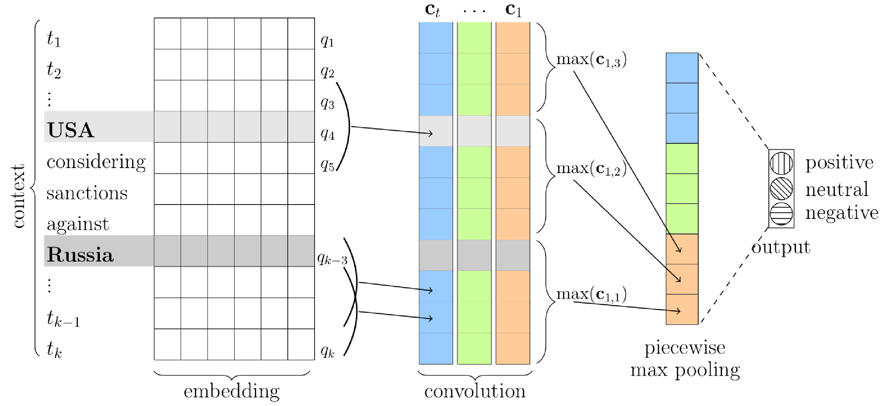

# sentiment-pcnn

This project represents an implementation of PCNN 
(Piecewise Convolutional Neural Network), written in Tensorflow.
Considered as an application for sentiment attitudes extraction task.

For more details, see:

1. [CLLS-2018, Presentation slides](docs/slides.pdf)

2. CEUR Workshop Proceedings (will be added soon)



Dataset
-------
We use [RuSentRel 1.0](https://github.com/nicolay-r/RuSentRel/tree/v1.0/)
corpus consisted of analytical articles from Internet-portal
inosmi.ru.
Table below illustrates CNN/PCNN results in comparison with **baselines**
(neg, pos, distr), and **classifiers** (KNN, SVM, Random Forest) 
based on handcrafted NLP features.
Last row represent an asessment of agreement between two annotators.

| Model               | Precision | Recall | F1(P,N)  |
|--------------------:|:---------:|:------:|:--------:|
|Baseline neg         |  0.03     | 0.39   | 0.05     |
|Baseline pos         |  0.02     | 0.40   | 0.04     |
|Baseline distr       |  0.05     | 0.23   | 0.08     |
|KNN                  |  0.18     | 0.06   | 0.09     |
|SVM (GRID)           |  0.09     | 0.36   | 0.15     |
|Random forest (GRID) |  0.41     | 0.21   | 0.27     |
| **CNN**  		        |  0.41     | 0.23   | **0.31** |
| **PCNN** 		        |  0.42     | 0.23   | **0.31** |
|Expert agreement     |  0.62     | 0.49   | 0.55     |

Installation
------------

Using [virtualenv](https://www.pythoncentral.io/how-to-install-virtualenv-python/).
Create virtual environment, suppose `my_env`, and activate it as follows:
```
virtualenv my_env
source my_env/bin/activate
```

Use `Makefile` to install
[core](https://github.com/nicolay-r/sentiment-erc-core) library and download
[dataset](https://github.com/nicolay-r/RuSentRel):
```
make install
```

We use word2vec
[model](http://rusvectores.org/static/models/rusvectores2/news_mystem_skipgram_1000_20_2015.bin.gz)
which were taken from rusvectores.org and used for an embedding layer completion:
```
make download_model
```

Usage
-----
The dataset provides only sentiment attitudes.
For extraction of positive and negative attitudes we additionally introduce
(extract from news) **neutral attudes** to distinguish really sentiment
attitudes from neutral one.

At first, we compose a list of neutral relations per each article by running:
```
./neutrals.py
```
And we are ready to apply model with different settings by simply rinning:
```
./predict_pcnn.py
```
Or a version which implements a cross validation:
```
./predict_pcnn_cv.py
```

References
----------

Daojian Zeng, Kang Liu, Yubo Chen, and Jun Zhao, Distant
supervision for relation extraction via piecewise convolutional
neural networks, Proceedings of the 2015 Conference on
Empirical Methods in Natural Language Processing, 2015,
pp. 1753–1762
