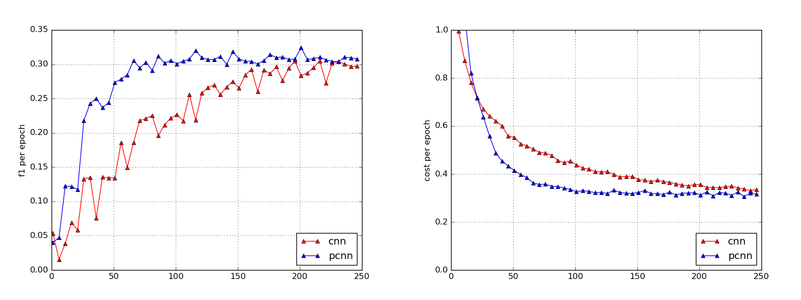

``# Sentiment Piecewise Convolutional Neural Network


This project represents an implementation of PCNN [[zeng2015distant](http://www.aclweb.org/anthology/D15-1203)], dubbed as
*Piecewise Convolutional Neural Network*, written in Tensorflow.
Considered as an application for sentiment attitudes extraction task.

Architectures implementation:
* [[cnn](networks/architectures/cnn.py)]
* [[pcnn](networks/architectures/pcnn.py)]

For more details, see (or [References](#references) section):

1. [[paper]](https://doi.org/10.29007/26g7) in
    Proceedings of Third Workshop "Computational linguistics and language science"
    
2. CLLS-2018, Presentation [slides](docs/slides.pdf)


Dataset
-------
We use [RuSentRel 1.0](https://github.com/nicolay-r/RuSentRel/tree/v1.0/)
corpus consisted of analytical articles from Internet-portal
inosmi.ru.

Results
-------
Model [[configuration](networks/configurations/cnn.py)].
Table below illustrates CNN/PCNN results in comparison with **baselines**
(neg, pos, distr), and **classifiers** (KNN, SVM, Random Forest)
based on handcrafted NLP features.
Last row represent an asessment of agreement between two annotators.

| Model               | Precision | Recall | F1(P,N)  |
|--------------------:|:---------:|:------:|:--------:|
|Baseline neg         |  0.03     | 0.39   | 0.05     |
|Baseline pos         |  0.02     | 0.40   | 0.04     |
|Baseline distr       |  0.05     | 0.23   | 0.08     |
|KNN                  |  0.18     | 0.06   | 0.09     |
|SVM (GRID)           |  0.09     | 0.36   | 0.15     |
|Random forest (GRID) |  0.41     | 0.21   | 0.27     |
| **CNN**  		      |  0.41     | 0.23   | **0.31** |
| **PCNN** 		      |  0.42     | 0.23   | **0.31** |
|Expert agreement     |  0.62     | 0.49   | 0.55     |

Comparison of CNN and PCNN during training process illustrated in figure below:


> Using default train/test separation of RuSentRel v1.0 collection; filters=200;
window\_size=3; **left subfigure**: F1(P, N) reults per epoch fot test subset; 
**right subfigure**: cost values per epoch;
using piecewise cnn results in training speed, and latter reach better results 
faster than vanilla cnn.

> **NOTE:** For cost evaluation, we use `tf.nn.sparse_softmax_cross_entropy_with_logits()` which 
compares results by an exact class, not by distribution; class weights were not taken
into account.

Installation
------------

Using [virtualenv](https://www.pythoncentral.io/how-to-install-virtualenv-python/).
Create virtual environment, suppose `my_env`, and activate it as follows:
```
virtualenv my_env
source my_env/bin/activate
```

Use `Makefile` to install
[core](https://github.com/nicolay-r/sentiment-erc-core) library and download
[dataset](https://github.com/nicolay-r/RuSentRel/tree/v1.0/):
```
make install
```

We use word2vec
[model](http://rusvectores.org/static/models/rusvectores2/news_mystem_skipgram_1000_20_2015.bin.gz)
which were taken from rusvectores.org and used for an embedding layer completion:
```
make download_model
```

Usage
-----
The dataset provides only sentiment attitudes.
For extraction of positive and negative attitudes we additionally introduce
(extract from news) **neutral attudes** to distinguish really sentiment
attitudes from neutral one.

At first, we compose a list of neutral relations per each article by running:
```
./neutrals.py
```
And we are ready to apply model with different settings by simply rinning:
```
./predict_cnn.py
```

References
----------

<a name="references"></a>
```
@inproceedings{CLLS2018:Using_Convolutional_Neural_Networks,
  author    = {Nicolay Rusnachenko and Natalia Loukachevitch},
  title     = {Using Convolutional Neural Networks for Sentiment Attitude Extraction from Analytical Texts},
  booktitle = {Proceedings of Third Workshop "Computational linguistics and language science"},
  editor    = {Gerhard Wohlgenannt and Ruprecht von Waldenfels and Svetlana Toldova and Ekaterina Rakhilina and Denis Paperno and Olga Lyashevskaya and Natalia Loukachevitch and Sergei O. Kuznetsov and Olga Kultepina and Dmitry Ilvovsky and Boris Galitsky and Ekaterina Artemova and Elena Bolshakova},
  series    = {EPiC Series in Language and Linguistics},
  volume    = {4},
  pages     = {1--10},
  year      = {2019},
  publisher = {EasyChair},
  bibsource = {EasyChair, https://easychair.org},
  issn      = {2398-5283},
  url       = {https://easychair.org/publications/paper/pQrC},
  doi       = {10.29007/26g7}}
```

Related works
-------------

* Daojian Zeng, Kang Liu, Yubo Chen, and Jun Zhao, Distant
supervision for relation extraction via piecewise convolutional
neural networks, Proceedings of the 2015 Conference on
Empirical Methods in Natural Language Processing, 2015,
pp. 1753–1762
[[paper](http://www.aclweb.org/anthology/D15-1203)]
